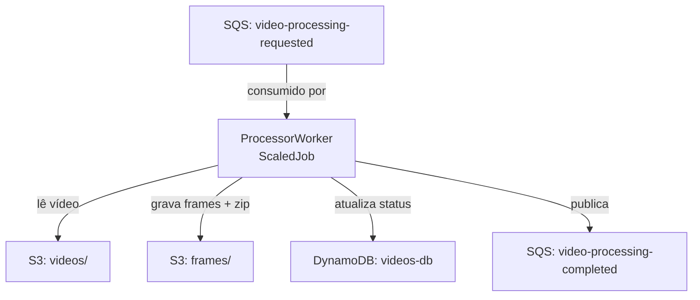

# FiapX.Processor

Serviço responsável por processar vídeos enviados pelos usuários no ecossistema FIAP X.

Consome a fila SQS `fiapx-{env}-video-processing-requested`, extrai frames do vídeo com FFmpeg, compacta o resultado em ZIP, armazena no S3 e publica o evento de conclusão.

## Definição do ambiente

- Runtime: Bun + TypeScript
- Framework: Elysia
- Mensageria: Amazon SQS
- Armazenamento: Amazon S3
- Banco de dados: Amazon DynamoDB



## Pré-requisitos

Para rodar localmente, é necessário ter o Docker em execução. O `docker-compose.yml` sobe o LocalStack com SQS, S3 e DynamoDB.

```bash
docker compose up -d
```

Copie o arquivo de variáveis de ambiente e ajuste conforme necessário:

```bash
cp .env.example .env
```

## Como executar localmente

```bash
bun install
bun run worker
```

## Script de deploy

Execute o script PowerShell para compilar a imagem e publicar no ECR.

```powershell
.\scripts\deploy-image.ps1 dev
```

Para publicar uma mensagem de teste na fila local:

```powershell
.\scripts\send-message.ps1
```

## Mensageria

### Consumers

| Fila | Descrição |
|------|-----------|
| `fiapx-{env}-video-processing-requested` | Dispara o processamento de um vídeo enviado pelo usuário. |

### Publishers

| Fila | Descrição |
|------|-----------|
| `fiapx-{env}-video-processing-completed` | Notifica sobre o resultado do processamento (sucesso ou falha). |

## Links úteis

- [fiapx-infra](https://github.com/13soat-fiapx/fiapx-infra)
- [fiapx-notifier](https://github.com/13soat-fiapx/fiapx-notifier)
- [fiapx-web](https://github.com/13soat-fiapx/fiapx-web)
