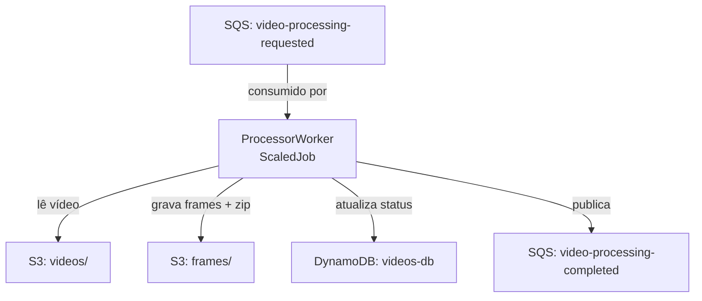

# FiapX.Processor

Serviço responsável por processar vídeos enviados pelos usuários no ecossistema FIAP X.

Consome a fila SQS `fiapx-{env}-video-processing-requested`, extrai frames do vídeo com FFmpeg, compacta o resultado em ZIP, armazena no S3 e publica o evento de conclusão.

## Definição do ambiente

- Runtime: Bun + TypeScript
- Framework: Elysia
- Mensageria: Amazon SQS
- Armazenamento: Amazon S3
- Banco de dados: Amazon DynamoDB



## Pré-requisitos

Para rodar localmente, é necessário ter o Docker em execução. O `docker-compose.yml` sobe o LocalStack com SQS, S3 e DynamoDB.

```bash
docker compose up -d
```

Copie o arquivo de variáveis de ambiente e ajuste conforme necessário:

```bash
cp .env.example .env
```

## Como executar localmente

```bash
bun install
bun run worker
```

## Script de deploy

Execute o script PowerShell para compilar a imagem e publicar no ECR.

```powershell
.\scripts\deploy-image.ps1 dev
```

Para publicar uma mensagem de teste na fila local:

```powershell
.\scripts\send-message.ps1
```

## Mensageria

### Consumers

| Fila | Descrição |
|------|-----------|
| `fiapx-{env}-video-processing-requested` | Dispara o processamento de um vídeo enviado pelo usuário. |

### Publishers

| Fila | Descrição |
|------|-----------|
| `fiapx-{env}-video-processing-completed` | Notifica sobre o resultado do processamento (sucesso ou falha). |

## Limites operacionais

| Limite | Padrão | Configuração |
|---|---|---|
| Duração máxima do vídeo | 600s (10 min) | env `MAX_VIDEO_DURATION_SECONDS` / `limits.maxVideoDurationSeconds` no chart |
| Tamanho máximo do arquivo | 314.572.800 bytes (300 MiB) | env `MAX_FILE_SIZE_BYTES` / `limits.maxFileSizeBytes` no chart |
| Grau de paralelismo | 3 workers simultâneos | `spec.maxReplicaCount` do `ScaledJob` / `limits.maxParallelJobs` no chart |

Ao exceder duração ou tamanho, o worker interrompe o processamento, grava `status=failed` com um código
próprio (`PROC-9001` para duração, `PROC-9002` para tamanho) e publica a falha em
`video-processing-completed`. O limite de paralelismo não gera erro: mensagens excedentes ficam na fila até
um worker ficar livre. `maxParallelJobs` não é lido pelo processo.

**`MAX_FILE_SIZE_BYTES`** é expresso em unidade binária (múltiplo de 1024², não 1000²), para bater com o
que o Explorer do Windows e a maioria dos SOs mostram. O valor foi recalibrado a partir de duas contas
independentes: (a) qualidade de vídeo — ~5 Mbps é uma taxa média defensável para H.264 1080p30
(`5.000.000 bits/s × 600s ÷ 8 ≈ 358 MiB`); (b) orçamento de memória do pod — `processVideo` baixa o vídeo
inteiro em memória antes de gravar em disco e depois lê todos os frames extraídos de volta para montar o
ZIP, então o teto de bytes precisa caber com folga no `resources.limits.memory` do `ScaledJob` (`1024Mi`),
o que dá um piso de ~343 MiB. As duas convergem na faixa ~343–358 MiB; o default de 300 MiB fica abaixo das
duas com margem extra, já que a estimativa de memória é engenharia, não profiling real.

**`maxParallelJobs`** também foi reduzido do "10" documentado em `limits.md` para 3, para bater com a
capacidade real do cluster de dev (`fiapx-infra`: até 3 nodes `t3.medium`, 2 vCPU/4 GiB cada) agora que o
`ScaledJob` define `resources` — um ambiente maior pode restaurar o "10" via `vars.MAX_PARALLEL_JOBS` na
Pipeline, sem tocar no chart.

Os três parâmetros são configuráveis por ambiente via `values.yaml` do chart (`k8s/values.yaml`, bloco
`limits`) ou via `--set` no deploy da Pipeline. `limits.md` ainda documenta os valores "de manual" do
sistema (500 MB / 10 workers); os defaults deste repositório divergem intencionalmente para o cluster atual,
pelos motivos acima. Para detalhes, consulte [Limites do sistema](https://github.com/13soat-fiapx/fiapx-docs/blob/main/docs/limits.md).

## Observabilidade

O serviço exporta traces, métricas e logs via OpenTelemetry direto para o intake OTLP do Datadog, sem Agent nem Collector. A integração fica em `src/shared/observability/` e aparece no Datadog como `fiapx-processor`.

- **Traces**: span de consumo `{fila} process` continuando o trace da API (header `traceparent` do envelope), spans das fases de processamento (`video.download`, `video.extract_frames`, `video.zip_upload`), spans `CLIENT` por chamada AWS e span de publicação `{fila} publish`. Toda span de negócio carrega a tag `video.id`.
- **Métricas**: `videos.processed` (tag `status`), `videos.processing_duration_seconds` (tag `status`) e `videos.frames_extracted`.
- **Logs**: correlacionados automaticamente ao trace (TraceId/SpanId) e também escritos no stdout.

A API key não é versionada. Localmente a observabilidade fica desligada por padrão e a aplicação registra `Datadog observability disabled` na inicialização. No cluster a key chega pela secret `observability/datadog-api-key`, espelhada para o namespace do serviço pelo Reflector e lida da env `DD_API_KEY`; se a secret não existir, o serviço sobe normalmente com a observabilidade desligada.

Por rodar como KEDA ScaledJob (processo de vida curta), o worker executa flush explícito dos três providers no encerramento — sem isso a telemetria do job inteiro se perde.

Duas diferenças em relação aos serviços .NET, por limitação do runtime:

- sem métricas de runtime (GC/thread pool), que o Bun não expõe de forma equivalente;
- sem instrumentação HTTP de servidor no `src/index.ts`, que é um stub de desenvolvimento (o container roda `bun run worker`).

Para um teste pontual contra o Datadog:

```powershell
$env:DD_API_KEY = "<valor da key>"
bun run worker
```

Arquitetura, configuração e troubleshooting: [Observabilidade](https://github.com/13soat-fiapx/fiapx-docs/blob/main/docs/observability.md).

## Links úteis

- [fiapx-infra](https://github.com/13soat-fiapx/fiapx-infra)
- [fiapx-notifier](https://github.com/13soat-fiapx/fiapx-notifier)
- [fiapx-web](https://github.com/13soat-fiapx/fiapx-web)
